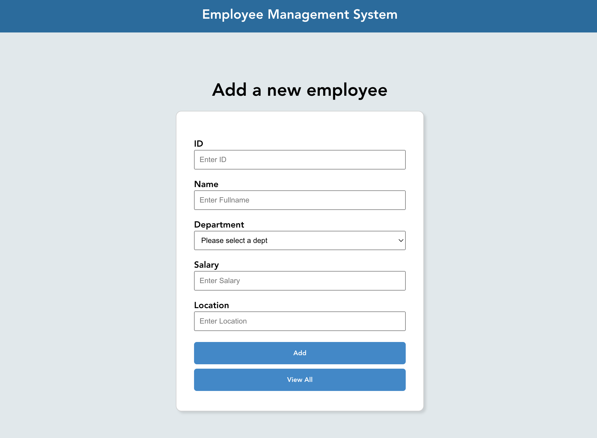

## Welcome! 👋

## Table of contents

- [Overview](#overview)
  - [Screenshot](#screenshot)
  - [Links](#links)
- [My process](#my-process)
  - [Built with](#built-with)
- [Author](#author)

# Overview

This is a small CRUD full stack app called EmployeeCMS which is supposed to emulate a Employee Management system that would keep track of employee information in a company. The frontend of the application was built with Vue.js and the backend is done through NodeJS, Express, and MongoDB. Users can create, read, update, and delete employee information.

# Screenshot

# Links

- Live site URL: https://employee-cms.netlify.app/

## My process

### Built with

- [HTML/CSS]
- [Vue](https://reactjs.org/)
- [Express](https://expressjs.com/)
- [NodeJS](https://nodejs.dev/)
- [MongoDB](https://www.mongodb.com/)

## Author

- Website - [Portfolio](https://www.aniyaallen.com/)